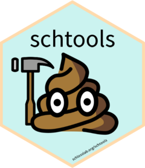

<!-- README.md is generated from README.Rmd. Please edit that file -->

# schtools <a href='http://www.schlosslab.org/schtools/'></a>

Schloss Lab Tools for Reproducible Microbiome Research 💩

<!-- badges: start -->

[](https://github.com/SchlossLab/schtools/actions)
[](https://app.codecov.io/gh/SchlossLab/schtools?branch=main)
[](https://github.com/SchlossLab/schtools/blob/main/LICENSE.md)
[](https://CRAN.R-project.org/package=schtools)
[](https://anaconda.org/conda-forge/r-schtools)


<!-- badges: end -->

A collection of useful functions and example code created and used by
the Schloss Lab for reproducible microbiome research. Perform common
tasks like read output files from [mothur](https://mothur.org), tidy up
your microbiome data, and format rmarkdown documents for publication.
See the [website](http://www.schlosslab.org/schtools/) for more
information, documentation, and examples.

## Installation

You can install the latest release from
[CRAN](https://cran.r-project.org/package=schtools):

``` r
install.packages("schtools")
```

or the development version from
[GitHub](https://github.com/SchlossLab/schtools) with:

``` r
# install.packages("devtools")
devtools::install_github("SchlossLab/schtools")
```

or install from a terminal using
[conda](https://docs.conda.io/projects/conda/en/latest/index.html) or
[mamba](https://mamba.readthedocs.io/en/latest/):

``` bash
mamba install -c conda-forge r-schtools
```

## Usage

Check out the [introductory
vignette](http://www.schlosslab.org/schtools/articles/introduction.html)
for a quick start tutorial or take a look at the [reference
documentation](http://www.schlosslab.org/schtools/reference/index.html)
for a comprehensive list of functions.

## Help & Contributing

If you come across a bug, [open an
issue](https://github.com/SchlossLab/schtools/issues) and include a
[minimal reproducible example](https://www.tidyverse.org/help/).

If you’d like to contribute, see our guidelines
[here](http://www.schlosslab.org/schtools/CONTRIBUTING.html).

## Code of Conduct

Please note that the schtools project is released with a [Contributor
Code of
Conduct](https://contributor-covenant.org/version/2/0/CODE_OF_CONDUCT.html).
By contributing to this project, you agree to abide by its terms.

## License

The schtools package is licensed under the [MIT
license](https://github.com/SchlossLab/schtools/blob/main/LICENSE.md#mit-license).
The logo is licensed under the [CC BY-SA
license](https://github.com/SchlossLab/schtools/blob/main/LICENSE.md#creative-commons-share-alike-license).

## Citation

``` 

To cite package 'schtools' in publications use:

  Sovacool K, Lesniak N, Schloss P (2022). _schtools: Schloss Lab Tools
  for Reproducible Microbiome Research_.
  http://www.schlosslab.org/schtools/,
  https://github.com/SchlossLab/schtools.

A BibTeX entry for LaTeX users is

  @Manual{,
    title = {schtools: Schloss Lab Tools for Reproducible Microbiome Research},
    author = {Kelly Sovacool and Nick Lesniak and Patrick Schloss},
    year = {2022},
    note = {http://www.schlosslab.org/schtools/,
https://github.com/SchlossLab/schtools},
  }
```
